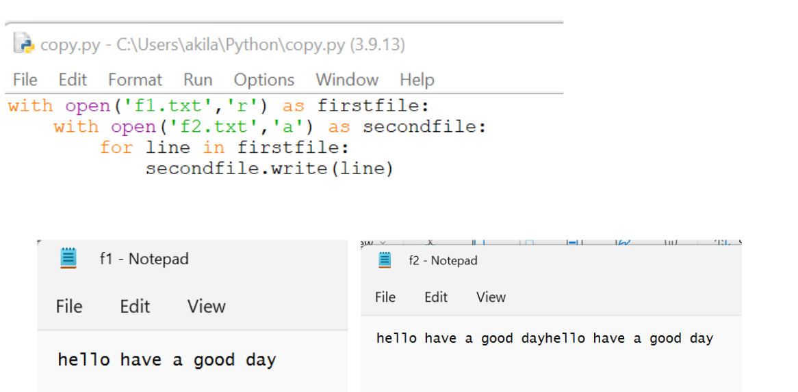

# copy-file
## AIM:
To write a python program for copying the contents from one file to another file.
## EQUIPEMENT'S REQUIRED: 
PC
Anaconda - Python 3.7
## ALGORITHM: 
### Step 1:
Recieve the input.

### Step 2: 
Open the firstfile.
 
### Step 3: 
Read through the lines.

### Step 4:  
Copy it in the second line.

### Step 5: 
Execute the code.

### Step 6: 
Verify the result.

## PROGRAM:
```python
'''
Developed by: Vishnupriya R
Reference number: 22006962
'''
with open('f1.txt','r') as firstfile:
  with open('f1.txt','r') as secondfile:
    for line in firstfile:
      secondfile.write(line)
```

### OUTPUT:



## RESULT:
Thus the program is written to copy the contents from one file to another file.